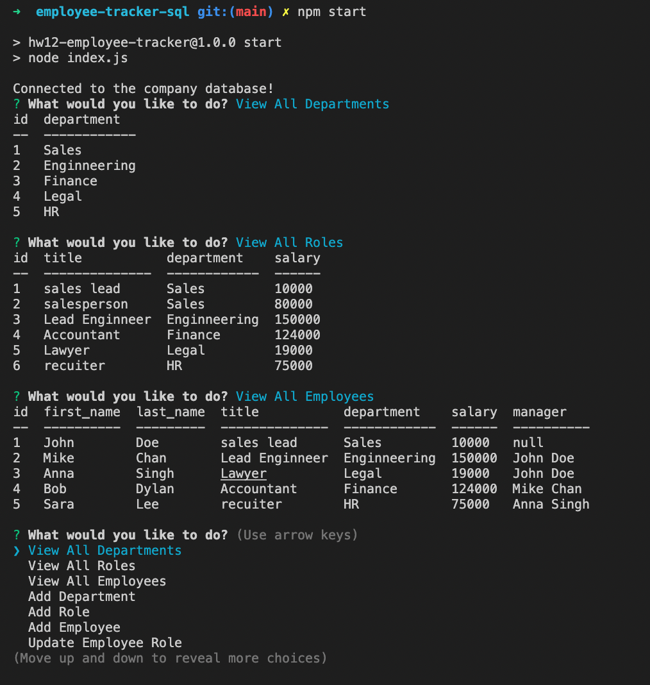

# employee-tracker-sql
## Week 12: SQL: Employee Tracker


### Description
- An interface that allows non-developers to view and interact with information stored in a databased. 
- So the user can view all departments, all the roles, and all the employees in the company database.
- The user can also add a new department, new role, and new employee. 
- The user can also update an employee's role

### Installation 
```
npm i 
npm start 
```

## Licence 
 This project is licensed under the [MIT License](https://opensource.org/licenses/MIT).

### Future Direction
In the future, I will be refactoring the index.js to be more visually easy to navigate. 

Also add new functionalities such as allow the users to view the total unilized budget of a department. 

## Link
https://github.com/fiona1nicdao/employee-tracker-sql

### Walkthrough Video
https://watch.screencastify.com/v/ttwykL1094oU9VxYvko6 


## Preview 

